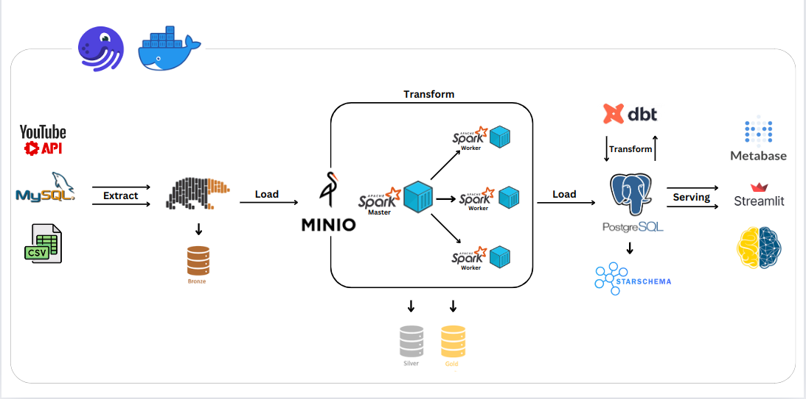
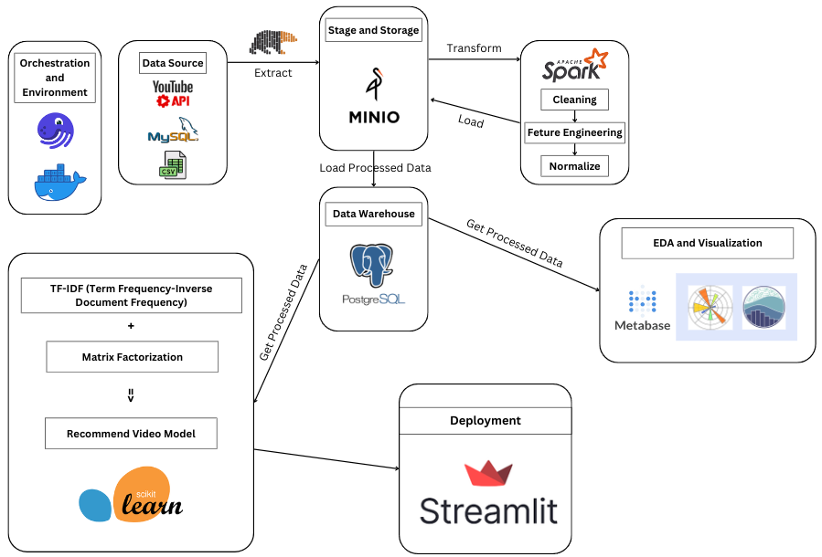

# 🌄 Youtube-ETL-Pipeline

This project demonstrates a complete end-to-end data pipeline using the ETL (Extract - Transform - Load) model for YouTube Trending Video data. The pipeline leverages big data tools like Apache Spark for processing, and serves use-cases such as fast video search and building a video recommendation system.

---

## 🔦 About Project



**Key Highlights:**

- **Data Sources:**
  - [YouTube Trending Video Dataset](https://www.kaggle.com/datasets/rsrishav/youtube-trending-video-dataset) (CSV, loaded into MySQL as a primary data source)
  - [YouTube API](https://developers.google.com/youtube/v3) (used for fetching extra fields like Video Link & Category using Video ID and Category ID)

- **ETL Flow:**
  - **Extract:** Data is extracted from MySQL (Kaggle CSV) and YouTube API, loaded into a MinIO datalake as the *raw layer* using Polars DataFrame.
  - **Transform:** Data is read from MinIO, converted from Polars DataFrame to PySpark DataFrame for processing. Intermediate results (*silver/gold layers*) are stored back in MinIO in Parquet format for performance.
  - **Load:** Gold layer data is loaded into PostgreSQL (data warehouse). Additional transforms with dbt create fast search indexes.
  - **Serving:** Data is visualized using Metabase, and a video recommendation app is served via Streamlit.
  - **Packaging & Orchestration:** Docker is used for containerization and Dagster for orchestrating pipeline assets.

---

## ⚡ Workflow



---

## 📦 Technologies Used

- MySQL
- YouTube API
- Polars
- MinIO
- Apache Spark (PySpark)
- PostgreSQL
- dbt
- Metabase
- Streamlit
- Dagster
- Docker
- Apache Superset


---

## 🦄 Features

- Modify or add new pipeline assets and perform custom aggregations as needed.
- Create or edit data charts and dashboards on Metabase & Apache Superset.
- Fast video search with any keyword, supporting multiple languages (Japanese, Canadian, German, Indian, Russian, etc.).
- Video recommendations based on category and tags.

---

## 👩🏽‍🍳 The Process

1. **Data Extraction:** Collect trending video data from Kaggle & fetch additional fields from YouTube API.
2. **Data Loading:** Store raw data in MinIO datalake.
3. **Transformation:** Use Spark (PySpark) for heavy data transformations and aggregations.
4. **Data Warehousing:** Load processed data into PostgreSQL; create search indexes with dbt.
5. **Serving & Visualization:** Use Metabase for BI dashboards and Streamlit for the recommendation app.
6. **Orchestration & Packaging:** Manage all services with Docker and coordinate workflows with Dagster.

---
## 🚦 Running the Project

**To run locally:**

1. **Clone the repository:**
   ```bash
   git clone https://github.com/longNguyen010203/Youtube-ETL-Pipeline.git
   ```

2. **Build Docker images and start services:**
   ```bash
   make build
   make up
   ```

3. **Access MySQL & check `local_infile`:**
   ```bash
   make to_mysql_root

   SET GLOBAL local_infile=TRUE;
   SHOW VARIABLES LIKE "local_infile";
   exit
   ```

4. **Create tables and load data:**
   ```bash
   make mysql_create
   make mysql_load
   make psql_create
   ```

5. **Run the pipeline and access UIs:**
   - [Dagster UI](http://localhost:3001) → Click "Materialize all" to run the pipeline
   - [MinIO UI](http://localhost:9001) → Check loaded data
   - [Spark UI](http://localhost:8080) → Monitor Spark and worker nodes
   - [Metabase](http://localhost:3030) → Charts and dashboards
   - [Streamlit App](http://localhost:8501) → Video recommendation app

---

## 🍿

Feel free to explore, extend, and experiment with every part of this pipeline!